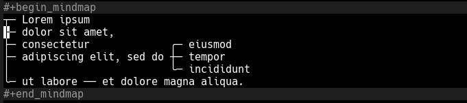

#+TITLE: org-mindmap

Editable mind maps for Org.

#+begin_src
#+begin_mindmap
               ╭─ dolor sit amet,                        ╭─ eiusmod
┬─ Lorem ipsum ┤              ╭─ adipiscing elit, sed do ┼─ tempor
               ╰─ consectetur ┤                          ╰─ incididunt
                              ╰─ ut labore ── et dolore magna aliqua.
#+end_mindmap
#+end_src

* Installation
If you're using Emacs version 29 or later:
#+begin_src elisp
(use-package org-mindmap
  :vc (:url "https://github.com/krvkir/org-mindmap.git" :rev :newest)
  :after org)
#+end_src

If you're using Emacs version prior to 29, clone this repo and use this:
#+begin_src elisp
(use-package org-mindmap
  :load-path "~/repos/emacs/org-mindmap/"
  :after org)
#+end_src

* Usage
** From scratch
Insert a mindmap block via =org-insert-structure-template= with =C-c C-, m=:
#+begin_src
\#+begin_mindmap
\#+end_mindmap
#+end_src

Add one root node. Just write it between the mindmap delimiters:
#+begin_src
\#+begin_mindmap
Root node
\#+end_mindmap
#+end_src

Add several siblings with =M-RET=, just as you'd do with a list:
#+begin_src
#+begin_mindmap
┬─ Root node
├─ Second node
╰─ Third node
#+end_mindmap
#+end_src

Move them around with =M-<up>=, =M-<down>=, =M-<left>= and =M-<right>=. Put the cursor on the node text and press one of those keys:
#+begin_src
#+begin_mindmap
┬─ Root node ┬─ Third node
             ╰─ Second node
#+end_mindmap
#+end_src

Here is the keys reference:

| Command                    | Hotkey          | Description                                                |
|----------------------------+-----------------+------------------------------------------------------------|
| =org-mindmap-move-down=      | =M-<down>=        | move node one sibling down                                 |
| =org-mindmap-move-up=        | =M-<up>=          | move node one sibling up                                   |
| =org-mindmap-promote=        | =M-<left>=        | move node one level up, i.e. make it its parent's sibling  |
| =org-mindmap-demote=         | =M-<right>=       | move node one level down, i.e. make it its sibling's child |
| =org-mindmap-insert-sibling= | =M-RET= , =C-c C-s= | add a node near the current one (as its sibling)           |
| =org-mindmap-insert-child=   | =C-c C-n=         | add a child node to the current one                        |
| =org-mindmap-insert-root=    | =C-c C-r=         | add a new root node                                        |
| =org-mindmap-delete-node=    | =C-c C-d=         | delete the current node and all its descendants            |
| =org-mindmap-align=          | =TAB=             | re-align the mindmap (if enabled via =org-mindmap-auto-align=) |

** From a list
Lists and mindmaps are mostly isomorphic: any list can be transformed to a corresponding mindmap without loss of data (except that bullet types and enumerated lists are not supported for now), and vice versa.

If you have a list, you can transform it to mindmap with =org-list-to-mindmap=:
#+begin_src
- For want of a nail
  - the shoe was lost,
- For want of a shoe
  - the horse was lost,
- For want of a horse
  - the rider was lost,
- For want of a rider
  - the battle was lost,
- For want of a battle
  - the kingdom was lost,
- And all for the want
  - of horseshoe nail.
#+end_src

#+begin_src
#+begin_mindmap
┬─ For want of a nail ── the shoe was lost,
├─ For want of a shoe ── the horse was lost,
├─ For want of a horse ── the rider was lost,
├─ For want of a rider ── the battle was lost,
├─ For want of a battle ── the kingdom was lost,
╰─ And all for the want ── of horseshoe nail.
#+end_mindmap
#+end_src
... and back to list with =org-mindmap-to-list=.

* Layouts
Mindmaps are only left to right. Two-sided mindmaps are not supported. Formatting inside nodes text is also not supported.

There are three layouts:
1. =left=, the simplest and the default one
#+begin_src 
#+begin_mindmap :layout left
┬─ root ng ┬─ node b ┬─ node d
│          │         ├─ node c
│          │         ╰─ node e ── node f
│          ╰─ node a
╰─ disk c: ┬─ Windows
           ╰─ Users
#+end_mindmap
#+end_src

2. =compact=, the one where nodes float up if there's space for them (like node a here).
#+begin_src 
#+begin_mindmap :layout compact
┬─ root ng ┬─ node b ┬─ node d
│          ╰─ node a ├─ node c
│                    ╰─ node e ── node f
╰─ disk c: ┬─ Windows
           ╰─ Users
#+end_mindmap
#+end_src

3. =centered=, like above, but the root nodes are vertically centered against their children.
#+begin_src 
#+begin_mindmap :layout centered
                     ╭─ node d
┬─ root ng ┬─ node b ┼─ node c
│          ╰─ node a ╰─ node e ── node f
╰─ disk c: ┬─ Windows
           ╰─ Users
#+end_mindmap
#+end_src

* Examples
Here's one more complex example mindmap for a chapter from Sönke Ahrens — How to Take Smart Notes.
#+begin_src 
#+begin_mindmap :layout centered
                          ╭─ мышления
                          ├─ изучения
┬─ Письмо ── помощник для ┼─ генерации идей
│                         ├─ чтения
│                         ╰─ понимания
├─ Мышление ── происходит на бумаге
├─ Правила ── держать ручку наготове
│                            ╭─ мимолётные :: напоминания о мыслях ┬─ помести в одно место
│                            │               ╭─ когда читаете      ╰─ обработай позже
│                            │               ├─ кратко
│                            ├─ о литературе ┼─ избирательно ── для своих тем
│                            │               ├─ своими словами
│                            │               ├─ с библиографическими данными
│                            │               ╰─ в картотеку     ╭─ мимолётные
│          ╭─ собери заметки ┤             ╭─ просмотри заметки ┼─ о литературе
│          │                 │             │                    ╰─ раз в день
│          │                 │             │                               ╭─ исследованиями
│          │                 │             ├─ подумай ── как соотносятся с ┼─ размышлениями
╰─ Процесс ┤                 │             ├─ одну для каждой идеи         ╰─ интересами
           │                 │             │                  ╭─ полные предложения
           │                 │             │                  ├─ источники
           │                 ╰─ постоянные ┼─ как для другого ┼─ ссылки
           ├─ преврати в черновик          │                  ├─ точно
           ╰─ отредактируй                 │                  ├─ ясно
                                           │                  ╰─ кратко
                                           ├─ выбрось ── мимолётные
                                           ├─ добавь ┬─ позади заметки, к которой относится напрямую
                                           │         ╰─ ссылки
                                           ╰─ убедись ── что сможешь найти ┬─ в указателе
                                                                           ╰─ в точке входа
#+end_mindmap
#+end_src
